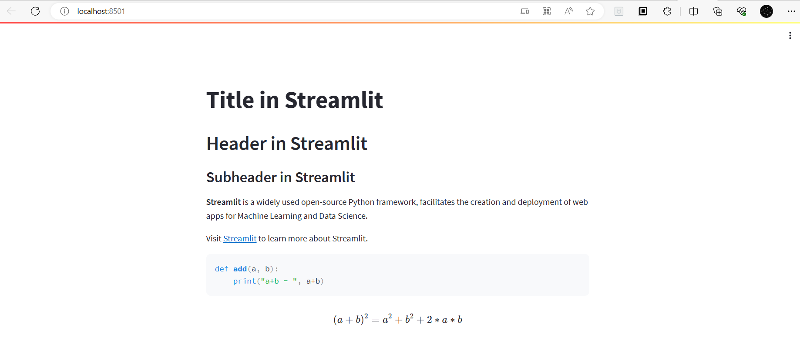
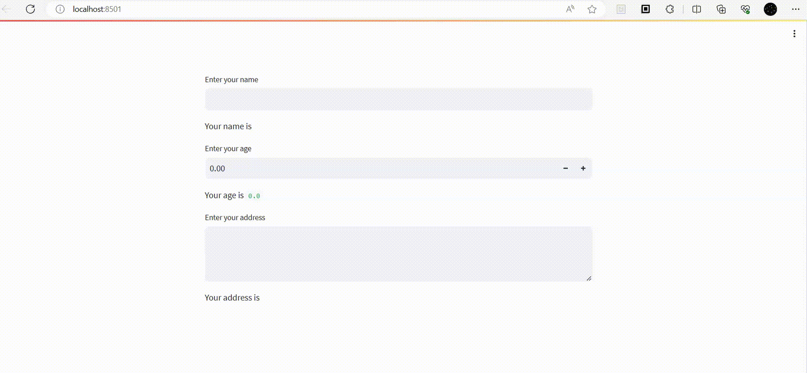
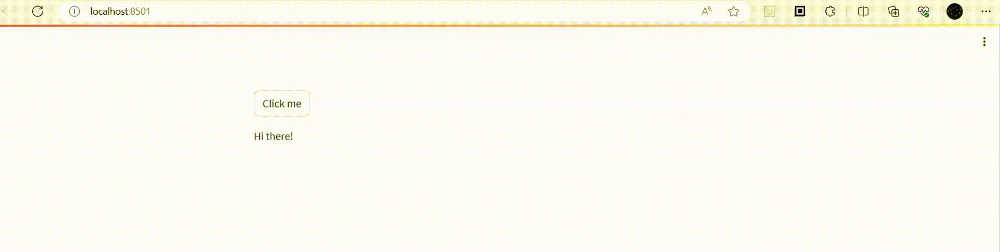
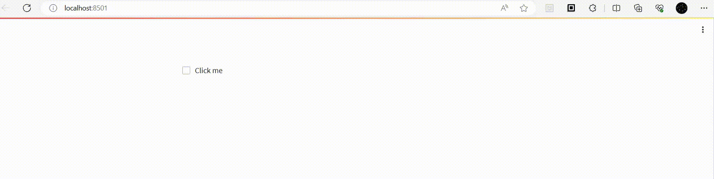
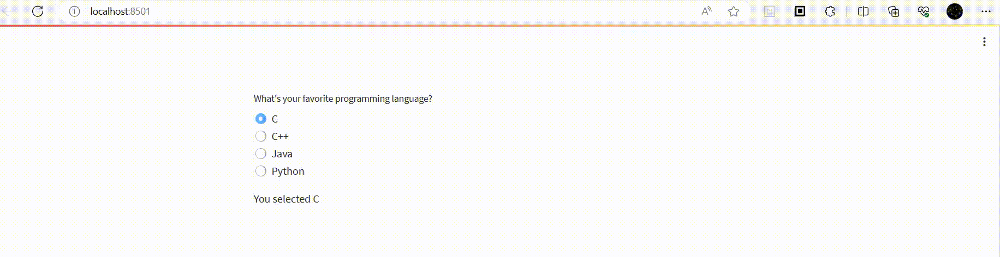
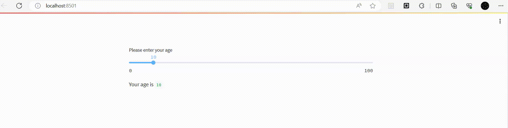
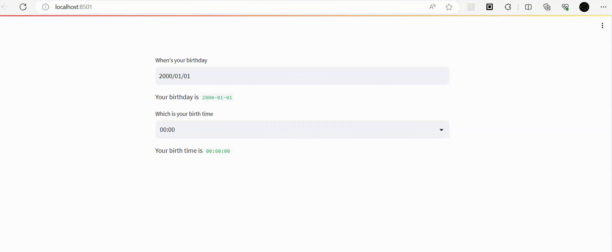
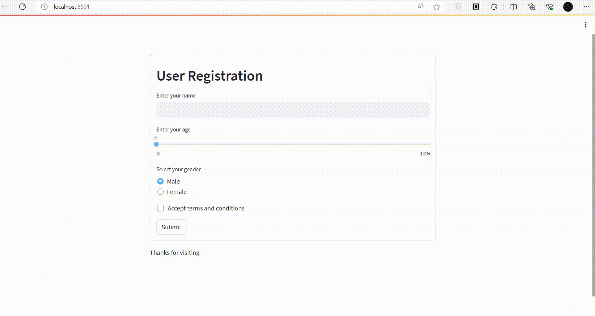
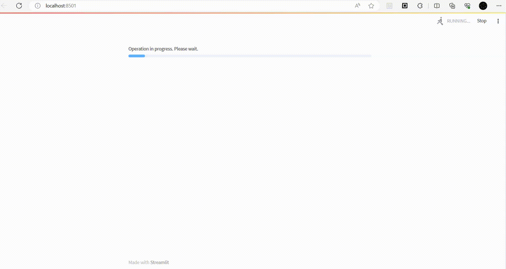
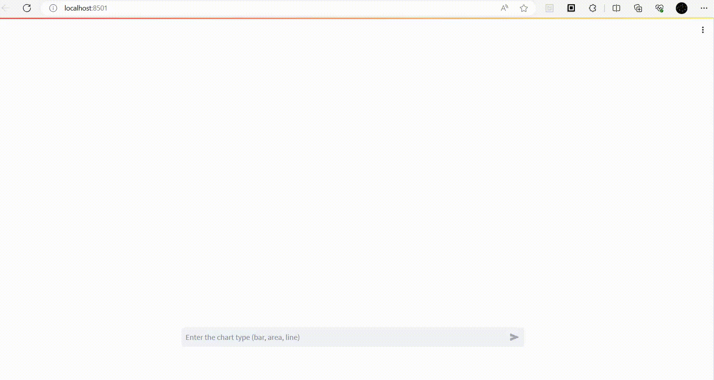

# Streamlit Cheatsheet

This repository contains some examples to explore streamlit elements.

## Prerequisites

- Python 3.8 or higher

## Steps to Run the Chat UI

1. Fork this repository or create a code space in GitHub.

2. Install the required Python packages by running the following command in your terminal:

   ```
   pip install -r requirements.txt
   ```

3. Run the following command in your terminal to start the app:

   ```
   streamlit run input_example.py
   ```

# Demos

1. Text

```py
import streamlit as st
 
# set the app's title
st.title("Title in Streamlit")
 
# header
st.header("Header in Streamlit")
 
# subheader
st.subheader("Subheader in Streamlit")
 
# markdown
# display text in bold formatting
st.markdown("**Streamlit** is a widely used open-source Python framework, facilitates the creation and deployment of web apps for Machine Learning and Data Science.")
# display text in italic formatting
st.markdown("Visit [Streamlit](https://docs.streamlit.io) to learn more about Streamlit.")
 
# code block
code = '''
def add(a, b):
    print("a+b = ", a+b)
'''
st.code(code, language='python')
 
# latex
st.latex('''
(a+b)^2 = a^2 + b^2 + 2*a*b
''')
```


2. Input

```py
import streamlit as st

# text input
name = st.text_input("Enter your name", "")
st.write("Your name is ", name)

age = st.number_input(label="Enter your age")
st.write("Your age is ", age)

address = st.text_area("Enter your address", "")
st.write("Your address is ", address)
```


3. Button

```py
import streamlit as st
 
#button
if st.button('Click me', help="Click to see the text change"):
    st.write('Welcome to Streamlit!')
else:
    st.write('Hi there!')
```


4. Checkbox

```py
import streamlit as st
 
# check box
checked = st.checkbox('Click me')
if checked:
    st.write('You agreed the terms and conditions!')
```

   
5. Radio

```py
import streamlit as st
 
# radio button
lang = st.radio(
    "What's your favorite programming language?",
    ('C','C++', 'Java','Python'))
 
if lang == 'C':
    st.write('You selected C')
elif lang == 'C++':
    st.write('You selected C++')
elif lang == 'C++':
    st.write('You selected Java')
else: 
    st.write('You selected Python')
```


6. Slider

```py
import streamlit as st
 
# slider
age = st.slider('Please enter your age', 
                   min_value=0, max_value=100, value=10)
st.write("Your age is ", age)
```


7. Date and Time

```py
import datetime
import streamlit as st

date = st.date_input("When's your birthday", datetime.date(2000, 1, 1), datetime.date(1990, 1, 1), datetime.datetime.now())
st.write("Your birthday is ", date)

time = st.time_input("Which is your birth time", datetime.time(0, 0))
st.write("Your birth time is ", time)
```


8. Form

```py
import streamlit as st

with st.form("user_form"):
   st.header("User Registration")
   name = st.text_input("Enter your name", "")
   age = st.slider("Enter your age")
   gender = st.radio("Select your gender", ('Male', 'Female'))
   terms = st.checkbox("Accept terms and conditions")

   # Every form must have a submit button.
   submitted = st.form_submit_button("Submit")
   if submitted:
        if terms:
            st.write("Name: ", name, ", Age: ", age, ", Gender: ", gender)
        else:
            st.write("Accept terms and conditions")

st.write("Thanks for visiting")
```


9. Status

```py
import streamlit as st
import time

# progress
progress_text = "Operation in progress. Please wait."
my_bar = st.progress(0, text=progress_text)

for percent_complete in range(100):
    time.sleep(0.1)
    my_bar.progress(percent_complete + 1, text=progress_text)

# spinner
with st.spinner('Wait for it...'):
    time.sleep(5)
st.success('Done!')

# messages 
st.toast('Your edited image was saved!', icon='😍')
st.error('This is an error', icon="🚨")
st.info('This is a purely informational message', icon="ℹ️")
st.warning('This is a warning', icon="⚠️")
st.success('This is a success message!', icon="✅")
e = RuntimeError('This is an exception of type RuntimeError')
st.exception(e)
```


10. Chart

```py
import streamlit as st
import pandas as pd
import numpy as np

# chart
chart_data = pd.DataFrame(
    np.random.randn(20, 3),
    columns=['a', 'b', 'c'])

st.line_chart(chart_data)
st.bar_chart(chart_data)
st.area_chart(chart_data)

df = pd.DataFrame(
    np.random.randn(1000, 2) / [50, 50] + [37.76, -122.4],
    columns=['lat', 'lon'])

st.map(df)
```


11. Data

```py
import streamlit as st
import pandas as pd
import numpy as np

# data frame
st.subheader("Data Frame")

df = pd.DataFrame(
   np.random.randn(50, 20),
   columns=('col %d' % i for i in range(20)))

st.dataframe(df)  # Same as st.write(df)

# table
st.subheader("Data Table")

df = pd.DataFrame(
   np.random.randn(10, 5),
   columns=('col %d' % i for i in range(5)))

st.table(df)

# data editor
st.subheader("Data Editor")

df = pd.DataFrame(
    [
       {"command": "st.selectbox", "rating": 4, "is_widget": True},
       {"command": "st.balloons", "rating": 5, "is_widget": False},
       {"command": "st.time_input", "rating": 3, "is_widget": True},
   ]
)
st.data_editor(df)

# metric
st.subheader("Data Metric")

st.metric(label="Temperature", value="70 °F", delta="1.2 °F")

col1, col2, col3 = st.columns(3)
col1.metric("Temperature", "70 °F", "1.2 °F")
col2.metric("Wind", "9 mph", "-8%")
col3.metric("Humidity", "86%", "4%")

# json
st.subheader("Data JSON")

st.json({
    'foo': 'bar',
    'baz': 'boz',
    'stuff': [
        'stuff 1',
        'stuff 2',
        'stuff 3',
        'stuff 5',
    ],
})
```


12. Chat

```py
import streamlit as st
import numpy as np

prompt = st.chat_input("Enter the chart type (bar, area, line)")
print(prompt)
if prompt == "bar":
    with st.chat_message("user"):
        st.write("Bar Chart Demo 👋")
        st.bar_chart(np.random.randn(30, 3))
elif prompt == "area":
    with st.chat_message("user"):
        st.write("Area Chat Demo 👋")
        st.area_chart(np.random.randn(30, 3))
elif prompt == "line":
    with st.chat_message("user"):
        st.write("Line Chat Demo 👋")
        st.line_chart(np.random.randn(30, 3))
elif prompt is not None:
    with st.chat_message("user"):
        st.write("Wrong chart type")
```
